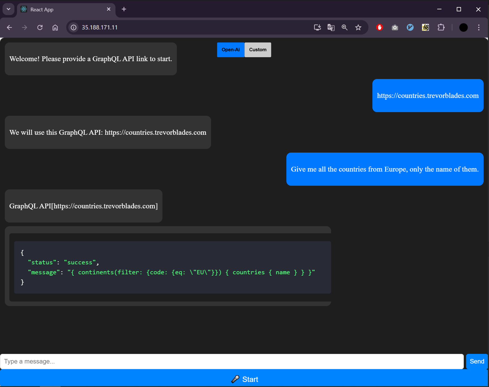

# GAIT - GraphQL API Interaction Tool



## 📌 Table of Contents
- [About](#about)
- [System Features](#system-features)
  - [GraphQL Query Generation](#graphql-query-generation)
  - [Backend Module](#backend-module)
    - [Architecture](#architecture)
    - [Flask API Endpoints](#flask-api-endpoints)
    - [Chatbot Module](#chatbot-module)
    - [NLP Module](#nlp-module)
    - [Database Module](#database-module)
    - [Speech-to-Text Module](#speech-to-text-module)
    - [External Integrations](#external-integrations)
- [Future Directions](#future-directions)


<a id="about"></a>

## 🛠 About

**GAIT** (GraphQL API Interaction Tool) is a powerful tool designed to facilitate seamless interaction with GraphQL APIs. It integrates **Natural Language Processing (NLP)** to interpret user input and convert it into structured GraphQL queries, enhancing usability for developers and researchers.

<a id="system-features"></a>

## ⚙️ System Features

<a id="graphql-query-generation"></a>

### 🚀 GraphQL Query Generation
- Converts natural language input into **GraphQL queries**.
- Ensures **syntactical correctness** and **query validation**.
- Provides **error handling** and **query suggestions**.

<a id="backend-module"></a>

### 🏗 Backend Module

<a id="architecture"></a>

#### 🏛 Architecture
The backend consists of several integrated components:
- **Flask API**: Handles HTTP requests and routes processing.
- **Chatbot Module**: Extracts user intent and dynamically constructs GraphQL queries.
- **NLP Module**: Utilizes OpenAI's models to improve query accuracy.
- **Database Module**: Stores API links and schemas in SQLite.
- **Speech-to-Text Module**: Processes audio input and converts it into text.

<a id="flask-api-endpoints"></a>

#### 🌐 Flask API Endpoints
- `POST /chat` - Receives user queries, processes them via the chatbot, and returns GraphQL queries or responses.
- `POST /speech-to-text` - Accepts audio files and converts them into text.

<a id="chatbot-module"></a>

#### 🤖 Chatbot Module
- Extracts **GraphQL API links** and schemas from user input.
- Uses NLP to generate **structured queries**.
- Validates GraphQL endpoints and stores schemas.

<a id="nlp-module"></a>

#### 🧠 NLP Module
- Leverages **OpenAI GPT models** to interpret user queries.
- Supports **context-aware** query generation.
- Enhances entity recognition for **better results**.

<a id="database-module"></a>

#### 🗄 Database Module
- Stores **GraphQL API links and schemas**.
- Clears outdated data upon **server restart**.

```sql
CREATE TABLE IF NOT EXISTS graphql_links (
    id INTEGER PRIMARY KEY AUTOINCREMENT,
    link TEXT UNIQUE NOT NULL,
    schema TEXT NOT NULL
);
```

<a id="speech-to-text-module"></a>

#### 🎙 Speech-to-Text Module
- Converts **audio-based user queries** into text.
- Integrates with **SpeechRecognition API**.

<a id="external-integrations"></a>

#### 🔗 External Integrations
- Utilizes **OpenAI API** for NLP-driven query interpretation.
- Communicates with external GraphQL APIs via **introspection queries**.

<a id="future-directions"></a>

## 🔮 Future Directions
- Additional GraphQL API **authentication methods**.
- **Advanced NLP model integration** for improved query accuracy.
- Support for **multiple languages** and extended API functionality.

🚀 **Stay tuned for future updates!**
